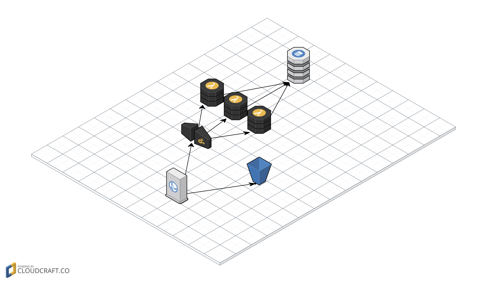

# Purpose

This repository contains a sample application to show the deployment of a serverless application hosted on AWS.

It is using the serverless application model to deploy the application using AWS CloudFormation.

The API backend is implemented using API Gateway and AWS Lambda.

The frontend is written using Angular JS.

## AWS Services used

* AWS Lambda - to provide the functionality
* API Gateway - as HTTPS endpoint for the backend
* CloudFront - as entry point to serve API and Frontend
* S3 - to store the static files for the web frontend
* DynamoDB -  database for the stored tasks
* IAM - for least privilege roles to grant access to the database

* CloudFormation - to deploy the application

# Development

The `backend` folder contains the Lambda code for the API and the `frontend` folder contains the Angular JS single page application.

You need NodeJS and NPM to develop in this project.

# Deployment

To deploy run the script `deploy.sh` from the command line and have the AWS CLI set up correctly.